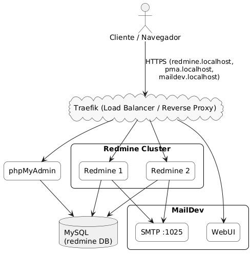

# Actividad Final: Despliegue de Servicios con Docker Compose y Traefik

## Servicios Usados

- **Redmine**: Gestión de proyectos (escalable)
- **MySQL**: Base de datos para Redmine
- **phpMyAdmin**: Administración web de MySQL
- **MailDev**: Servidor SMTP para pruebas
- **Traefik**: Proxy inverso, balanceador de carga y terminador TLS

## Arquitectura

- Todos los servicios corren en contenedores Docker conectados a la red `proxy_net`.
- Traefik expone los servicios de forma segura usando HTTPS y certificados autofirmados.
- Redmine es escalable (puede tener múltiples réplicas) y accede a MySQL internamente.
- phpMyAdmin y MailDev permiten administración y pruebas.
- Traefik enruta el tráfico según el hostname solicitado.

### Diagrama Simplificado



## Comandos para Correr

```bash
# Levantar todos los servicios
docker compose up -d

# Levantar con 2 réplicas de Redmine
docker compose up -d --scale redmine=2
```

## Certificados

- Se usan certificados autofirmados generados con OpenSSL.
- Los archivos deben estar en la carpeta `certs/` (`local.crt` y `local.key`).
- Traefik los utiliza para exponer los servicios por HTTPS en *.localhost.

## Sitios de Acceso

- **Redmine:** [https://redmine.localhost](https://redmine.localhost)
- **phpMyAdmin:** [https://pma.localhost](https://pma.localhost)
- **MailDev:** [https://maildev.localhost](https://maildev.localhost)
- **Traefik Dashboard:** [https://traefik.localhost](https://traefik.localhost)


---

## Descripción

El objetivo es desplegar localmente varios servicios escalables y exponerlos de forma segura a través de un solo endpoint. Se utiliza Docker Compose para orquestar los contenedores y Traefik como proxy inverso y balanceador de carga, gestionando certificados SSL y enrutamiento por hostname.

---

**Repositorio preparado para pruebas y desarrollo local.